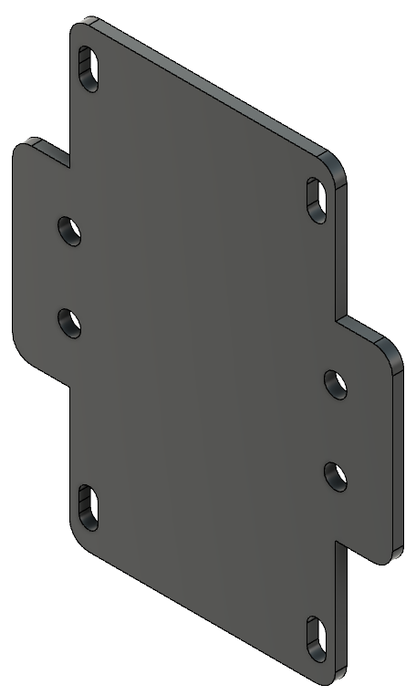

# DIY-C-Beam-CNC
My custom built cbeam based cnc machine for hobby projects

The reason i created this repository is to share and store all my custom built parts to complete my cnc project.
Initially i had this bracket lasercut from 3mm alu, but later had it cut from 3mm mild steel.

